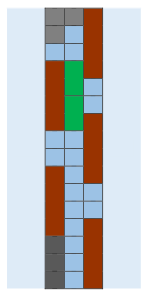

# Search algorithm

I build this simple game for using search algorithms in a live project.         
this game is a good start for beginners who want to learn a smart algorithm to build smart again.
if you are a student who takes  AI course this project will be very useful to you.
I implement a lot of search algorithms with this game like **DFS,BFS,A-star,Dijkstra,...**     
this game is a very simple game you need to reconnect the bridge bricks to cross the river, there is no GUI for this game 
but it's very easy to build one.



in this image, we can see the bord and 4 types of cell the **Blue** which represent water and I can step over it, 
the **Broun** which represents the wood and this is the only type I can move, the **Green** which represents the grace I can't move but I can step over, the **Gray** which represents Block that can't move and can't step over. 

I use IntelliJ IDE community edition so if you have this software all you need is to open the project in IDE and run it.
the most important **classes** you need to understand the environment and the search algorithm are :


1- environmetn section:   

        A- cell       
        B- Grid             
        C- Game                
    
2-smart Search algrithm :             

        A- SmartPlayer              
        B- State              

all the rest class it's for Exception, display, Enum,......
you should read the class in the previous order to understand the game.

for the Search algorithm the state class is creat object state this state stores the current board of the game, what I mean by that I consider the current board as the node in the graph and search for the best next node in the graph which means the best state of the game that brings me close to the solution.

**SmartPlayer** this class contains all search algorithm you can change the way play in the main class when we call p1.playwithDFS() you can change the method to this:

    PlaywithDFS
    playwithBFS
    playwithDijkstra
    playwithAStar
    playwithHillClime

each method implements a different search algorithm and when you try it you will see the difference in the solution.

I hope you will enjoy learning this stuff and find a better way to implement your Own project.

    


```python

```
